# Optimizing Online Sport Retail Revenue with SQL

## Introduction
In this notebook, I used  SQL skills to analyze product data for an online sports retail company.

## Skills/Concept Demonstrated
I worked with numeric, string, and timestamp data on pricing and revenue, ratings, reviews, descriptions, and website traffic.
I used techniques such as aggregation, cleaning, labeling, Common Table Expressions, and correlation to produce recommendations on how the company can maximize revenue!

## Sports clothing and athleisure attire is a huge industry, worth approximately $193 billion in 2021 with a strong growth forecast over the next decade!
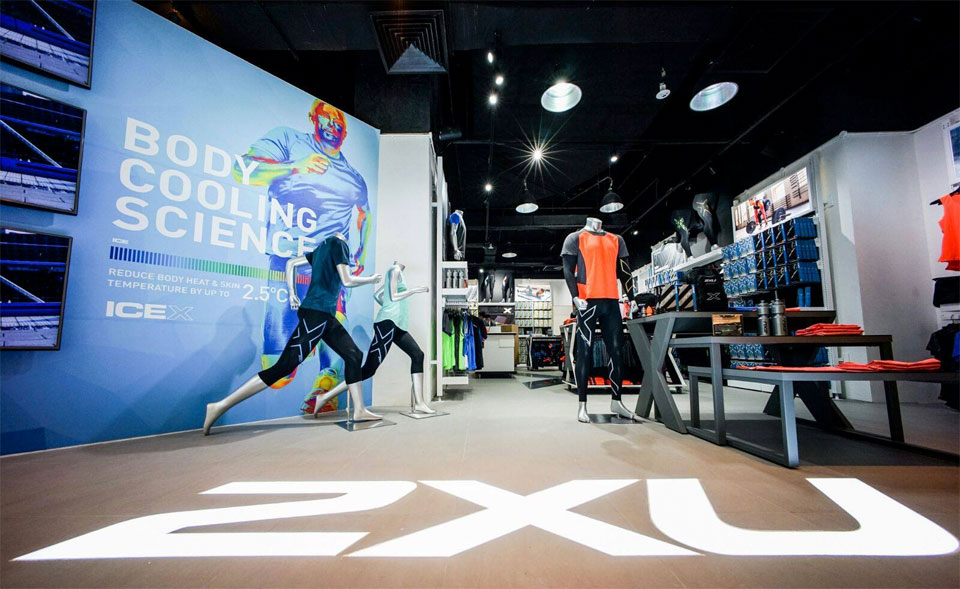
___

I played the role of a product analyst for an online sports clothing company. The company is specifically interested in how it can improve revenue. We will dive into product data such as pricing, reviews, descriptions, and ratings, as well as revenue and website traffic, to produce recommendations for its marketing and sales teams.

### 1) Let's start by finding out how complete the data is.
We will be dealing with missing data as well as numeric, string, and timestamp data types to draw insights about the products in the online store.
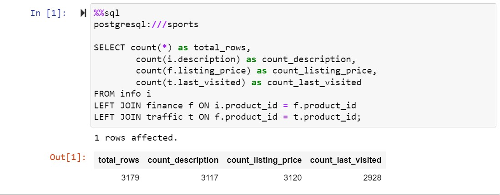

### 2) Nike vs Adidas pricing
We can see the database contains 3,179 products in total. Of the columns we previewed, only one — last_visited — is missing more than five percent of its values. Now let's turn our attention to pricing.

How do the price points of Nike and Adidas products differ? Answering this question can help us build a picture of the company's stock range and customer market. We will run a query to produce a distribution of the listing_price and the count for each price, grouped by brand.

  Query             |    
:----------------------:  
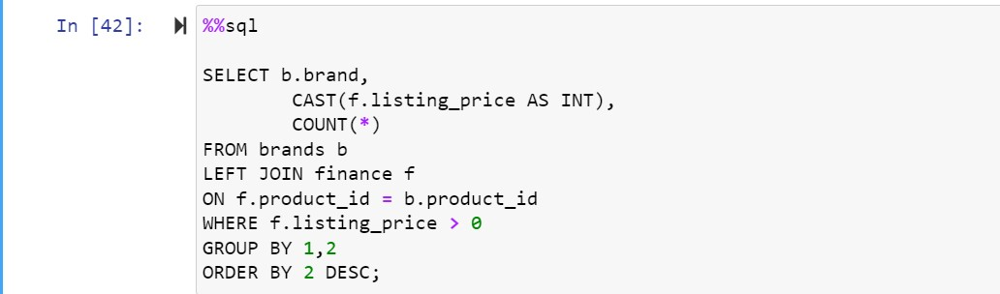   
 |   Output 

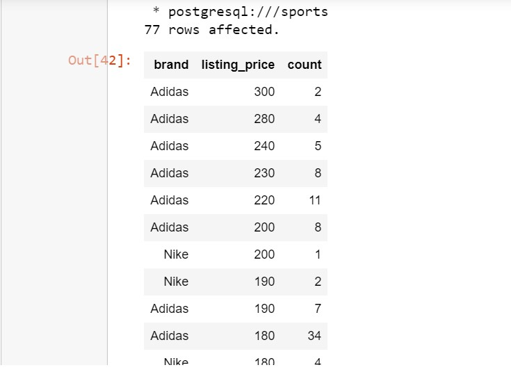

### 3) Labeling price ranges
It turns out there are 77 unique prices for the products in our database, which makes the output of our last query quite difficult to analyze.

Let's build on our previous query by assigning labels to different price ranges, grouping by brand and label. We will also include the total revenue for each price range and brand.

  Query             |    
:----------------------:  
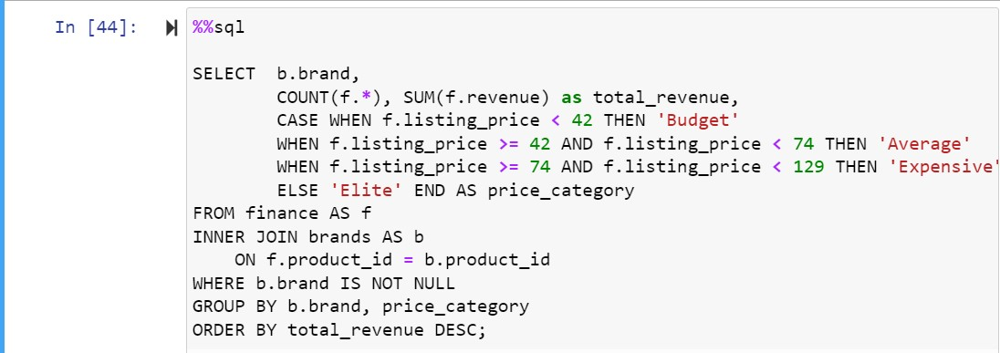   
 |   Output 

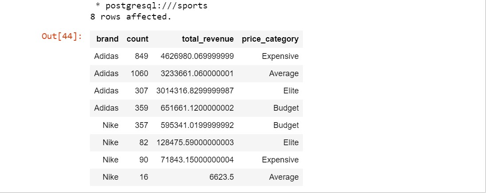

### 4) Average discount by brand
Interestingly, grouping products by brand and price range allows us to see that Adidas items generate more total revenue regardless of price category! Specifically, "Elite" Adidas products priced at $129 or more typically generate the highest revenue, so the company can potentially increase revenue by shifting their stock to have a larger proportion of these products!

Note we have been looking at listing_price so far. The listing price may not be the price that the product is ultimately sold for. To understand revenue better, let's take a look at the discount, which is the percent reduction in the listing price when the product is sold. We would like to know whether there is a difference in the amount of discount offered between brands, as this could be influencing revenue.

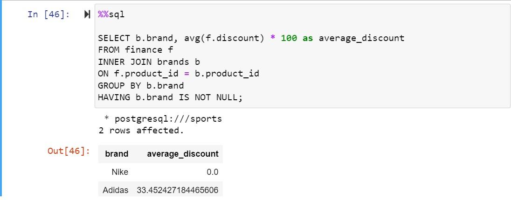   

### 5) Correlation between revenue and reviews
Strangely, no discount is offered on Nike products! In comparison, not only do Adidas products generate the most revenue, but these products are also heavily discounted!

To improve revenue further, the company could try to reduce the amount of discount offered on Adidas products, and monitor sales volume to see if it remains stable. Alternatively, it could try offering a small discount on Nike products. This would reduce average revenue for these products, but may increase revenue overall if there is an increase in the volume of Nike products sold.

Now explore whether relationships exist between the columns in our database. We will check the strength and direction of a correlation between revenue and reviews

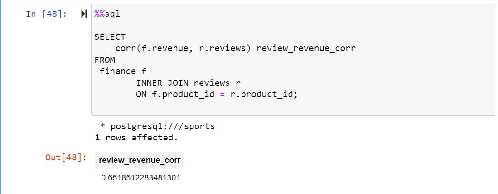   

### 6) Ratings and reviews by product description length
Interestingly, there is a strong positive correlation between revenue and reviews. This means, potentially, if we can get more reviews on the company's website, it may increase sales of those items with a larger number of reviews.

Perhaps the length of a product's description might influence a product's rating and reviews — if so, the company can produce content guidelines for listing products on its website and test if this influences revenue. Let's check this out!

  Query             |    
:----------------------:  
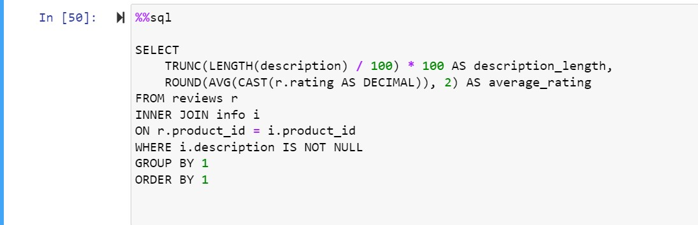   
 |   Output 

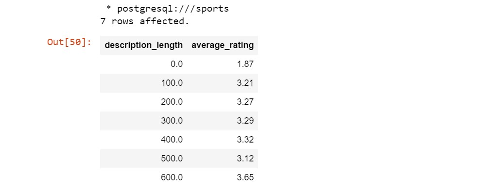

### 7) Reviews by month and brand
Unfortunately, there doesn't appear to be a clear pattern between the length of a product's description and its rating.

As we know a correlation exists between reviews and revenue, one approach the company could take is to run experiments with different sales processes encouraging more reviews from customers about their purchases, such as by offering a small discount on future purchases.

Let's take a look at the volume of reviews by month to see if there are any trends or gaps we can look to exploit.

  Query             |    
:----------------------:  
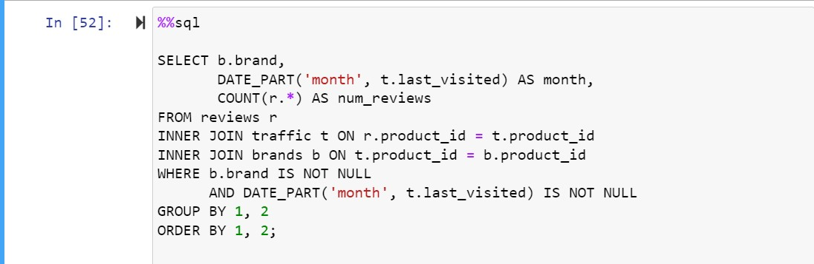   
 |   Output 

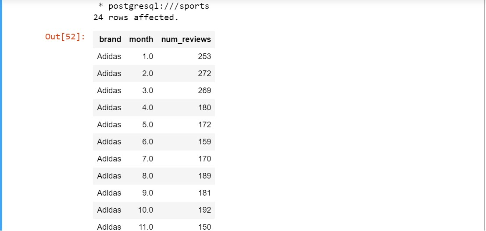

### 8) Footwear product performance
Looks like product reviews are highest in the first quarter of the calendar year, so there is scope to run experiments aiming to increase the volume of reviews in the other nine months!

So far, we have been primarily analyzing Adidas vs Nike products. Now, let's switch our attention to the type of products being sold. As there are no labels for product type, we will create a Common Table Expression (CTE) that filters descriptions for keywords, then use the results to find out how much of the company's stock consists of footwear products and the median revenue generated by these items.

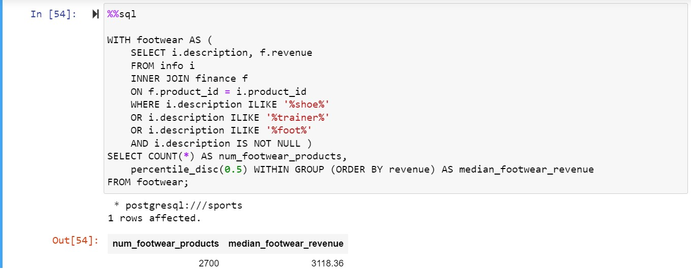  

### 9) Clothing product performance
Recall from the first task that we found there are 3,117 products without missing values for description. Of those, 2,700 are footwear products, which account for around 85% of the company's stock. They also generate a median revenue of over 3000 dollars!

This is interesting, but we have no point of reference for whether footwear's median revenue is good or bad compared to other products. So, for our final task, let's examine how this differs from clothing products. We will re-use footwear, adding a filter afterward to count the number of products and median revenue of products that are not in footwear.

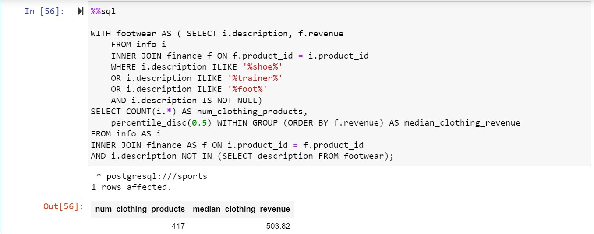 

### Conclusion
Throughout our analysis, we delved deep into various aspects of our product data, including pricing, reviews, descriptions, ratings, revenue, and website traffic. Our primary goal was to identify opportunities to enhance revenue for our online sports clothing company.

We discovered several insights that can guide our marketing and sales teams toward achieving this objective. Firstly, we observed a positive correlation between reviews and revenue, suggesting that incentivizing more customer reviews could lead to increased sales. Encouraging customers to provide feedback by offering discounts or rewards may prove to be an effective strategy.

Additionally, our analysis highlighted the importance of product descriptions. While there wasn't a clear correlation between the length of descriptions and ratings, ensuring that descriptions are informative, engaging, and accurately reflect the product's features and benefits can positively influence customer perceptions and purchasing decisions.

Furthermore, we identified trends in website traffic and reviewed the volume of reviews by month to uncover potential opportunities for targeted marketing campaigns or promotions during peak traffic periods.

In conclusion, by leveraging the insights gained from our analysis, we can develop targeted marketing strategies, optimize product descriptions, and incentivize customer feedback to drive revenue growth for our online sports clothing company.
